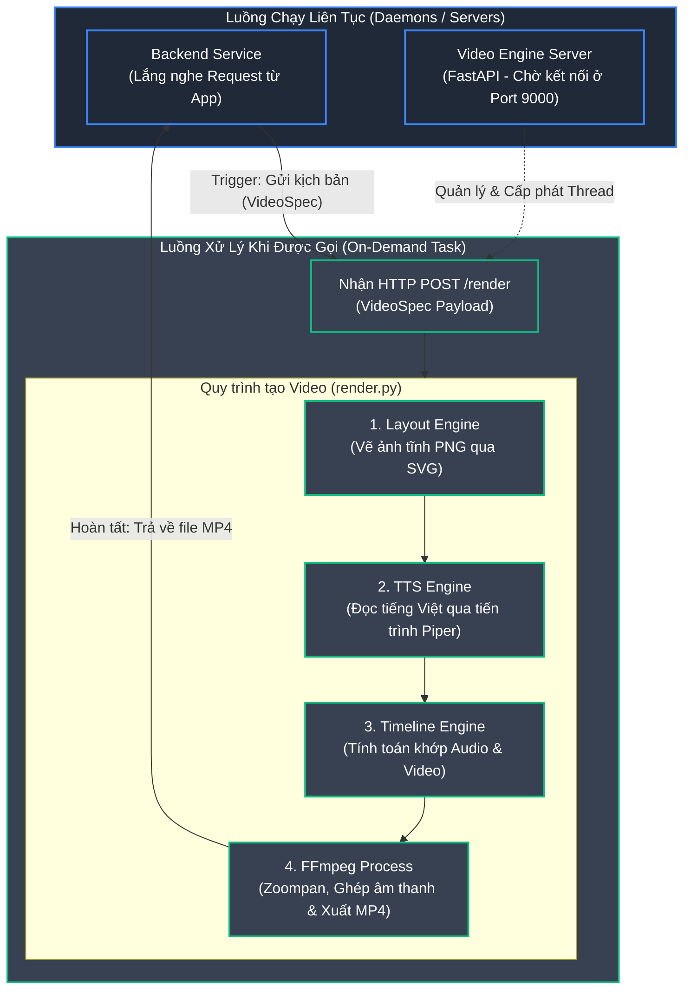

# Kiến trúc & Luồng hoạt động của Hệ thống Video

Dưới đây là sơ đồ luồng hoạt động (Architecture / Flow Diagram) giải thích chi tiết cách hệ thống sinh video vận hành. Sơ đồ này phân tách rõ ràng **thành phần chạy liên tục** (Luồng nền/Server) và **thành phần chạy theo yêu cầu** (Luồng khi có request).

---

## Giải thích chi tiết

### 1. Khối chạy liên tục (Always-on / Daemons)
Đây là các dịch vụ luôn luôn thức, tiêu tốn một lượng nhỏ RAM/CPU cố định để duy trì trạng thái sẵn sàng lắng nghe và xử lý.
- **Video Engine Server (FastAPI):** Dịch vụ mà chúng ta vừa xây dựng. Ngay khi bạn chạy lệnh `docker compose up`, Uvicorn (web server của Python) sẽ khởi động và giữ 1 cổng mạng (`Port 9000`). Trạng thái của nó là "ngủ" chờ đợi, không làm gì nặng cho đến khi có ai đó gọi tên nó.
- **Backend Service:** Là server chính của ứng dụng Dev Radar. Nó cũng chạy liên tục để phục vụ API cho Web/Mobile App.

### 2. Khối chạy khi được gọi (On-Demand / Triggered)
Đây là phần lõi sinh video. Toàn bộ dây chuyền (Pipeline) này **không tốn bất kì CPU nào** cho đến khi Backend thực sự kích hoạt bằng cách gửi kịch bản (VideoSpec) vào `/render`. 

Khi nhận được lệnh, luồng hoạt động sẽ diễn ra **tuần tự** như sau:
1. **Layout Engine (SVG -> PNG):** 
   - Đọc các chữ trong kịch bản (ví dụ: *fastapi, 75000 sao*).
   - Tự động ngắt dòng chữ (wrap text) cho vừa khung hình.
   - Vẽ ra một bức ảnh tĩnh `.png` 720x1280 tuyệt đẹp (có gradient, có bo góc, có ngôi sao).
2. **TTS Engine (Text-to-Speech):**
   - Đem những câu thoại tiếng Việt (*"nhận được bảy mươi lăm nghìn sao"*) đi "đọc".
   - Video Engine sẽ "đánh thức" một tiến trình con (Sub-process) tên là `piper`. Piper đọc xong, tạo ra 1 file âm thanh `.wav` rồi tự động tắt đi để giải phóng RAM.
3. **Timeline Engine (Toán học đồng bộ):**
   - Phân tích file `.wav` xem độ dài chính xác là bao nhiêu giây (ví dụ: 10.7s).
   - Tính toán để ảnh tĩnh số 1 phải hiển thị trên màn hình đúng 10.7s, khớp đến từng mili-giây với giọng nói.
4. **FFmpeg Process (Giai đoạn nặng nhất):**
   - Gọi một phần mềm quay dựng video cực mạnh là FFmpeg lên (cũng chạy dưới dạng tiến trình con rồi tắt đi).
   - Trộn tất cả ảnh `.png` và âm thanh `.wav` vào lò.
   - Thêm bộ lọc `zoompan`: Phóng to khung ảnh từng milimet ở mỗi giây để tạo cảm giác video đang chuyển động (Ken Burns effect).
   - Nén lại thành file `.mp4` siêu nhẹ và kết thúc quy trình.

**Kết quả:** File `.mp4` được lưu xuống ổ cứng và đường dẫn trả về cho Backend. Backend lúc này sẽ tiếp tục công việc của mình (lưu vào database, tải lên Cloud, gửi thông báo cho Mobile App...).
